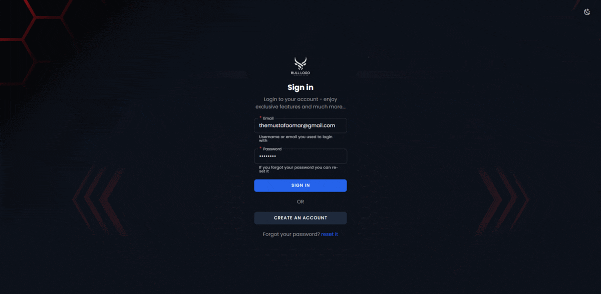

# Vue Starter

🌟 Welcome to Vue starter!

Explore the world of modern web development with our feature-packed Vue starter project, using cutting-edge technologies like Vue, Vuetify, Pinia, and Vite, it's designed to make your front-end development journey a breeze.



## Key Features 🚀

- Real-Time Chat System: Engage users with a powerful and feature-rich real-time chat system supports chat text and voice messages and typing indicator etc...
- Real-Time Notifications: The starter has a great real-time notifications system.
- Widgets: A set of beautiful charts using ChartJs (more coming soon)
- Access Control List (ACL): Leveraging Laravel's Spatie Permissions, we ensure smooth control on both the client and server sides.
- Validation Handling: Handle client-side and server-side validations effortlessly with zero-configuration.
- File Uploads Made Easy: Effortlessly upload files with simplified functionality.
- Theme Support: Enjoy light and dark theme options for a personalized user experience (in development).
- Multiple Layouts: Create your custom layouts to suit your application's needs.
- Multilingual-Ready: The starter has a multilingual-ready support.
- Complete Authentication System: Ensure security with a comprehensive authentication system.
- Flexible Middleware Functionality: Flexible middleware functionlaity for client-side using custom callbacks with roles and permissions.
- Code Quality: Maintain consistency with standard ESLint and Prettier configurations.
- Environment Variables: Easily manage different environments using .env and .env.production.

⚡ And More to Come!

## Installation

Clone the repository using the following command:

```bash
git clone git@github.com:themustafaomar/vue-starter.git
```

Install the dependencies and run the project using:

```bash
npm i && npm run dev
```

### Docker

To work with Docker please navigate to the [backend project](https://github.com/themustafaomar/vue-starter-server) and run the following command:

```bash
./vendor/bin/sail up --build
```

You can call sail directly if you have it installed globally with the following command, more information about sail please visit the offical [documentation](https://laravel.com/docs/10.x/sail).

```bash
sail up --build
```

This will run the frontend and the backend without doing anything, you'll just need to run the migrations:

```bash
sail artisan migrate --seed
```

#### Broadcasting

As for broadcasting we're using the offical Reverb websocket server, for more information about Reverb please visit the offical documentation: https://laravel.com/docs/10.x/reverb

Once you run `sail up` in your terminal the websocket server will run automatically using supervisor which I already done it for you, it's configured in ./docker/8.3/supervisord.conf this is what it looks like:

```conf
[program:reverb]
command=php /var/www/html/artisan reverb:start --host="0.0.0.0" --port=8080
autostart=true
autorestart=true
user=%(ENV_SUPERVISOR_PHP_USER)s
redirect_stderr=true
stdout_logfile=/var/www/html/storage/logs/reverb.log
```

#### Queues

I chose not to add laravel worker configuration for you, I prefer running the following command each time because I need to restart the queues a lot, however this is the supervisor worker configuration.

```conf
[program:laravel-worker]
process_name=%(program_name)s_%(process_num)02d
command=php /var/www/html/artisan queue:work --sleep=3 --tries=3 --max-time=3600
autostart=true
autorestart=true
stopasgroup=true
killasgroup=true
user=sail
numprocs=1
redirect_stderr=true
stdout_logfile=/var/www/html/storage/logs/worker.log
stopwaitsecs=3600
```

## Server Side

For the server-side source code please visit: https://github.com/themustafaomar/vue-starter-server

## Licence

Vue starter project licensed under MIT.
